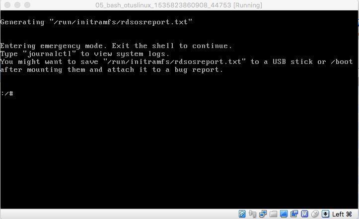

## Select OS

During the boot, press any button and you will see this screen

Press `e` and the loader config will appeared

## rd.break

Add `rd.break` after line started with `linux16`

After that, press `Ctrl+X`, and you will see a bash terminal

## init

Replace `ro` with `rw init=/sysroot/bin/sh` and remove `console=ttySO` in line `linux16`

After that, you will see a bash terminal 

