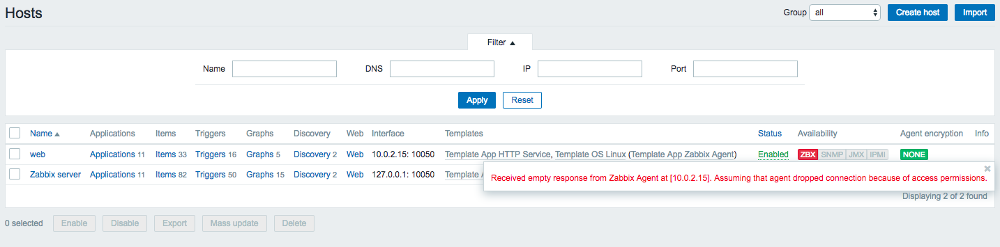

## Проблема с подключением web к zabbix

На сервере `web`:
* Обновил firewall-cmd:

```
firewall-cmd --permanent --new-service=zabbix
firewall-cmd --permanent --service=zabbix --add-port=10050/tcp
firewall-cmd --permanent --service=zabbix --set-short="Zabbix Agent"
firewall-cmd --permanent --add-service=zabbix
firewall-cmd --reload
```

* Добавил правило в iptables:

```
iptables -I INPUT 1 -p tcp --dport 10050 -j ACCEPT
```

* Обновил selinux

```
setsebool -P httpd_can_connect_zabbix=1
```

В результате в `Configuration -> Hosts` у сервера `web` ошибка вида

```
Received empty response from Zabbix Agent at [10.0.2.15]. Assuming that agent dropped connection because of access permissions.
```




[Zabbix agent log](zabbix_agent.log)
[Zabbix agent conf](zabbix_agentd.conf)
